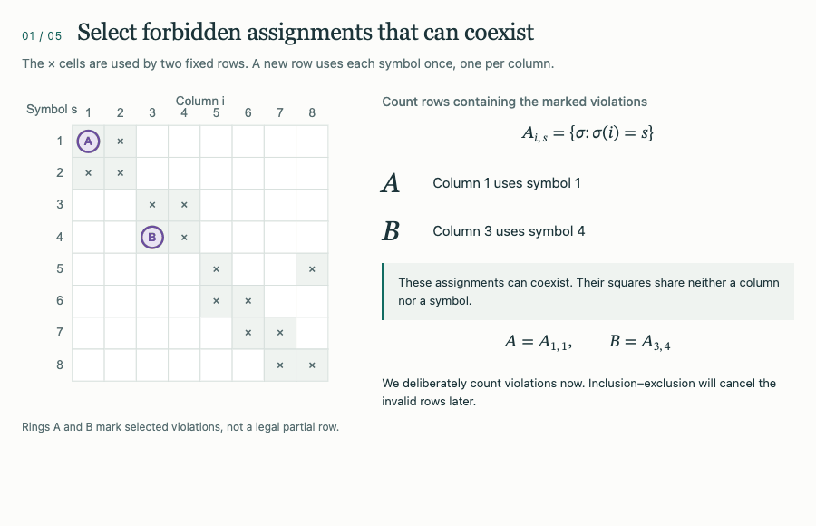
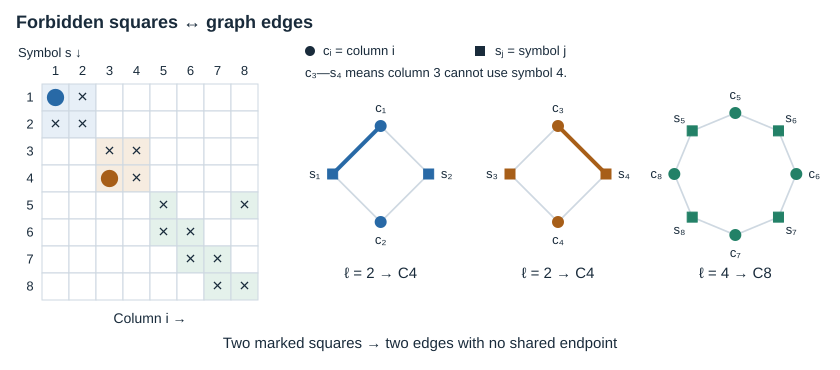
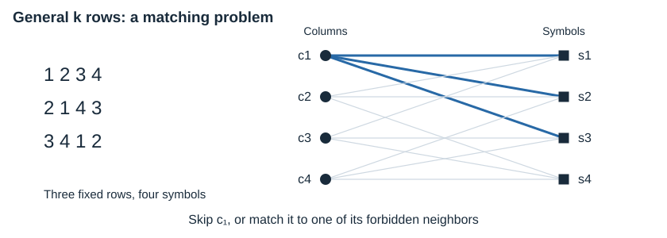
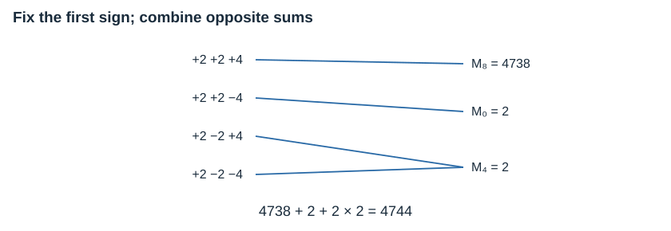

# Latin Rectangles

Exact counts for extending a Latin rectangle: append rows that use every symbol
once and never repeat a symbol in a column. The library combines specialized
**two-row methods based on permutation cycles and Touchard’s identity** with
**general k-row counting on forbidden bipartite graphs**.

<p><picture>
  <source media="(prefers-reduced-motion: reduce) and (max-width: 600px)" srcset="docs/assets/math-motion/counting-still-mobile.png">
  <source media="(prefers-reduced-motion: reduce)" srcset="docs/assets/math-motion/counting-still-desktop.png">
  <source media="(max-width: 600px)" srcset="docs/assets/math-motion/counting-mobile.gif">
  
</picture></p>

*Follow the count: compatible violations → rook counts → unrestricted
completions → inclusion–exclusion. This paced preview plays once; static figures
and equations keep the reasoning available below.*

[How it works](#how-it-works) · [General k-row counting](#general-k-row-counting) · [API and methods](#api-and-methods)

## Try it

Requires Python 3.12+. Install in your project with `uv add latin-rectangles`, or
run `uvx latin-rectangles --c "2,2,4"` to try the illustrated example directly.

```python
from latin_rectangles import count_extensions, count_extensions_from_cycle_type

# Two fixed rows; the relative permutation has cycle lengths 2, 2 and 4.
count_extensions_from_cycle_type([2, 2, 4])  # 4744 legal third rows

# Three explicit rows; a leading zero marks the 1-indexed representation.
rows = [[0, 1, 2, 3, 4], [0, 2, 1, 4, 3], [0, 3, 4, 1, 2]]
count_extensions(rows)  # 1 legal fourth row
```

### Count all rectangles of a given size

From a source checkout:

```console
uv run latin-rectangles total -r 4 -c 20
```

`-r` specifies rows and `-c` specifies columns. This counts every labeled
4-row, 20-column Latin rectangle: rows are ordered, columns are labeled, and
the symbols are `1, ..., 20`. The Python equivalent is
`count_latin_rectangles(4, 20)` from `latin_rectangles`.

Total counts use specialized recurrences for up to three rows and generalized
Doyle inclusion-exclusion for larger heights. Cost grows steeply with the
number of rows; this is intended for fixed, small heights. Use `total --help`
for options, including `--full-output` for very large counts.
[Algorithm and conventions](docs/methods.md#10-total-counts-by-dimensions)

## How it works

### Rows become forbidden positions

For the illustrated two-row start, relabel the symbols so the first row is the
identity. The second row is the permutation

```math
\pi=(1\;2)(3\;4)(5\;6\;7\;8).
```

An entry σ(i) of a proposed next row becomes a dot at position (i, σ(i)) on a
board. A valid row has one dot in each board row and column, avoiding the used
positions (i, i) and (i, π(i)). Equivalently, each forbidden square is an edge
between a column vertex cᵢ and a symbol vertex sⱼ.

<p><picture>
  <source media="(max-width: 600px)" srcset="docs/assets/math-readme/board-components-mobile.svg">
  
</picture></p>

Each vertex has degree two, so a permutation cycle of length ℓ gives a graph
cycle with 2ℓ vertices. Nonattacking rooks on the forbidden board correspond
exactly to graph matchings: selected edges with no shared endpoint.

### Count matchings, then apply inclusion–exclusion

Let rⱼ be the number of ways to place j nonattacking rooks on the forbidden
board. The rook polynomial records these numbers; independent graph components
multiply:

```math
R_B(x)=\sum_{j=0}^{n}r_jx^j
       =\prod_{C\in\mathrm{components}(B)}R_C(x).
```

For the two-row case, write R<sub>ℓ</sub> for the polynomial of a length-ℓ permutation
cycle. In this example:

```math
\begin{aligned}
R_2(x)&=1+4x+2x^2,\\
R_4(x)&=1+8x+20x^2\\
      &\quad+16x^3+2x^4,\\
R_B(x)&=R_2(x)^2R_4(x).
\end{aligned}
```

The figure highlights one compatible pair of forbidden assignments. Of the
120 pairs of forbidden squares, eight share a column and eight share a symbol.
These rejected groups do not overlap, giving

```math
r_2=\binom{16}{2}-8-8=104.
```

Fixing j compatible assignments leaves (n−j)! unrestricted permutations,
including those with further forbidden assignments. For the selected pair,
six columns and six symbols remain: 6! = 720 completions. Inclusion–exclusion
combines these overlapping counts:

```math
E=\sum_{j=0}^{n}(-1)^j r_j(n-j)!.
```

A row with two violations is counted once, subtracted twice, and added back
once: 1−2+1 = 0. More generally, a row with t > 0 violations has weight

```math
\sum_{j=0}^{t}(-1)^j\binom{t}{j}=(1-1)^t=0.
```

A legal row appears only in the initial count and keeps a weight of one.
For this board, the coefficients are `(1, 16, 104, 352, 662, 688, 376, 96, 8)`.
Their alternating factorial sum gives **4,744** legal third rows—the same answer
as enumerating all 8! candidates.

## General k-row counting

With k existing rows, column i has forbidden edges to each of its k used
symbols. The graph still factors over connected components, but for k > 2
those components need not be cycles. The example below has three rows and a
single connected forbidden component.

<p><picture>
  <source media="(max-width: 600px)" srcset="docs/assets/math-readme/general-graph-mobile.svg">
  
</picture></p>

The component algorithm branches on a column c. A matching either leaves c
unmatched, or uses exactly one edge from c to a neighboring symbol s:

```math
R_F(x)=R_{F-c}(x)
       +x\sum_{s\in N_F(c)}R_{F-\{c,s\}}(x).
```

Memoization over the remaining column and symbol masks reuses these subproblems.
After multiplying the component polynomials, the same inclusion–exclusion
formula gives the next-row count. For the displayed three-row board it gives
**one** fourth row.

The first row may be nonidentity: relabelling symbols standardizes it without
changing the count. A single existing row uses the derangement recurrence.
For several added rows, `rows_to_add` counts **ordered** extensions by recursing
over valid intermediate rows. The general matching computation is exponential
in the largest component size; multiple added rows are intended for small-n
exact work. [Full general-method derivation](docs/methods.md#8-general-k-x-n---k--t-x-n-method)

## Two rows: Touchard’s reduction

Two-row cycle polynomials have extra structure. Reverse their coefficients and
alternate the signs:

```math
q_\ell(t)=t^\ell R_\ell(-1/t),\qquad \ell\ge2.
```

These polynomials satisfy the sum-and-difference identity

```math
q_a(t)q_b(t)=q_{a+b}(t)+q_{|a-b|}(t),
```

with formal endpoints q₀ = 2 and q₁ = t−2. One way to see it is to write

```math
q_\ell(t)=y^\ell+y^{-\ell},\qquad y+y^{-1}=t-2,
```

then multiply. Repeated application gives

```math
q_2(t)^2q_4(t)=q_8(t)+2q_4(t)+q_0(t).
```

<p><picture>
  <source media="(max-width: 600px)" srcset="docs/assets/math-readme/touchard-mobile.svg">
  
</picture></p>

The linear functional F(tᵈ) = d! turns each reversed polynomial into its
inclusion–exclusion count, M<sub>ℓ</sub> = F(q<sub>ℓ</sub>). Thus the same answer reduces to

```math
E=M_8+2M_4+M_0=4738+2\cdot2+2=4744.
```

M₀ = 2 is a formal polynomial value, not the count for an empty rectangle.
The implementation evaluates the sign-sum multiplicities with subset-sum
counts and reuses cached M<sub>ℓ</sub> values. This is **Touchard’s 1934 counting identity**;
[the derivation and attribution](docs/methods.md#5-derivation-of-touchards-formula)
are documented. It is specific to the two-row structure; the general k-row
method above uses component matching polynomials directly.

## API and methods

| Starting data | Function |
|---|---|
| Row and column counts | `count_latin_rectangles(rows, columns)` |
| Explicit Latin-rectangle rows | `count_extensions(rows, rows_to_add=1)` |
| Identity first row and a deranged second row | `count_extensions_from_derangement(p, rows_to_add=1)` |
| Relative cycle lengths of two rows | `count_extensions_from_cycle_type(lengths, rows_to_add=1)` |

The cycle-type API offers `auto`, `touchard`, `rook` and `rook_ntt` methods for
one added row. Counts use integers throughout. The optional transform path uses
NTT/CRT reconstruction with schoolbook fallback; it is not floating-point FFT.
The favorable method depends on structure, coefficient size and cache state.

- [Methods, equations and method selection](docs/methods.md)
- [Benchmark workloads and reproduction](docs/benchmarks.md)
- [Independent correctness checks](tests/test_independent_verification.py)
- [Generation and CLI regression checks](tests/test_workflow_audit.py)
- [Development and reproduction](DEVELOPMENT.md)

## License

[MIT](LICENSE).
