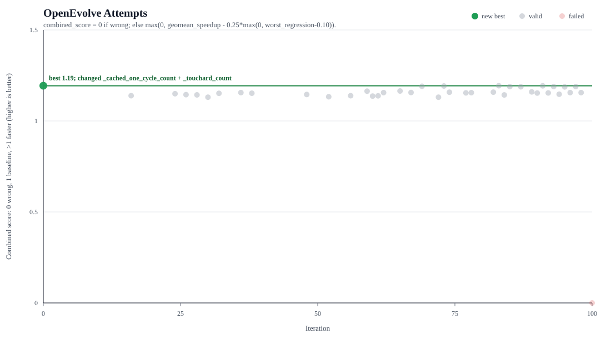

# OpenEvolve Touchard Cold-Start Problem

This directory is the OpenEvolve problem package for the Latin-rectangles
autoresearch run.

It is OpenRouter-first and does not require storing secrets in this repository.

## Files

- `initial_program.py`: seed program with the evolve block. OpenEvolve mutates
  this file.
- `evaluator.py`: OpenEvolve evaluator. It imports a candidate program, runs the
  cold-start benchmark workloads, checks exact result digests, and returns
  metrics/artifacts.
- `config.openrouter.yaml`: OpenEvolve config using OpenRouter as the model
  endpoint and cheap Qwen coding models as the first model choices.
- `config.openrouter.sonnet45.yaml`: OpenEvolve config for a stronger Claude
  Sonnet 4.5 comparison run.

## Dry Evaluation

This direct evaluator check does not call any model API:

```console
uv run tools/autoresearch/openevolve_touchard/evaluator.py \
  tools/autoresearch/openevolve_touchard/initial_program.py
```

The seed program should return `correctness = 1.0` and a positive
`combined_score`. The score should now be close to 1 for the seed: the
evaluator compares candidates against the package's direct private Touchard
implementation rather than the slower public wrapper path.

To check that OpenEvolve itself can load the problem without making model calls:

```console
uvx --from openevolve openevolve-run \
  tools/autoresearch/openevolve_touchard/initial_program.py \
  tools/autoresearch/openevolve_touchard/evaluator.py \
  --config tools/autoresearch/openevolve_touchard/config.dry.yaml \
  --output /tmp/latin_openevolve_dry
```

## OpenRouter Run

Set a token without printing it:

```console
export OPENROUTER_API_KEY="sk-or-v1-..."
```

Then run:

```console
LATIN_AUTORESEARCH_PROFILE=smoke \
LATIN_AUTORESEARCH_METHOD=touchard \
uvx --from openevolve openevolve-run \
  tools/autoresearch/openevolve_touchard/initial_program.py \
  tools/autoresearch/openevolve_touchard/evaluator.py \
  --config tools/autoresearch/openevolve_touchard/config.openrouter.yaml \
  --iterations 5 \
  --output benchmark_results/autoresearch/openevolve_touchard_smoke
```

Or use the repo wrapper:

```console
tools/autoresearch/run_openevolve_openrouter.sh \
  --env-file /path/to/batch-doc-vqa/.env \
  --profile smoke \
  --method touchard \
  --iterations 5
```

The wrapper accepts `.env` files containing `OPENROUTER_API_KEY`,
`OPENCODE_API_KEY`, or `OPENAI_API_KEY`. It maps the key into
`OPENROUTER_API_KEY` for this run only and does not print or persist it.

The OpenEvolve evaluator uses repeated median timing by default:

- `LATIN_AUTORESEARCH_REPETITIONS=3`
- baseline: direct private Touchard path for `method=touchard`
- candidate: evolved `count_cycle_type`

This prevents the seed from being rewarded merely for bypassing public API
dispatch overhead.

For the Claude Sonnet 4.5 trial:

```console
tools/autoresearch/run_openevolve_openrouter.sh \
  --env-file .env \
  --profile smoke \
  --method touchard \
  --config tools/autoresearch/openevolve_touchard/config.openrouter.sonnet45.yaml \
  --iterations 100000 \
  --max-seconds 600 \
  --grace-seconds 120 \
  --output benchmark_results/autoresearch/openevolve_touchard_smoke_sonnet45_10min_fresh
```

For a longer run, use `LATIN_AUTORESEARCH_PROFILE=quick` and raise
`--iterations`.

## Continuing A Run

Within one run, OpenEvolve is informed by earlier attempts: each candidate has a
parent program, the population database retains top/diverse programs, and the
prompt includes previous attempt history and metrics.

Across separate launches, continue from a checkpoint. Without `--checkpoint`,
OpenEvolve starts a fresh search from `initial_program.py`.

```console
tools/autoresearch/run_openevolve_openrouter.sh \
  --env-file .env \
  --profile smoke \
  --method touchard \
  --iterations 100 \
  --checkpoint benchmark_results/autoresearch/openevolve_touchard_smoke_flash_strict_cache_first/checkpoints/checkpoint_5 \
  --output benchmark_results/autoresearch/openevolve_touchard_smoke_flash_resume
```

## One-Hour Run

OpenEvolve is iteration-based, so use a high iteration cap plus the wrapper's
wall-clock guard:

```console
tools/autoresearch/run_openevolve_openrouter.sh \
  --env-file .env \
  --profile smoke \
  --method touchard \
  --iterations 100000 \
  --max-seconds 3600 \
  --grace-seconds 180 \
  --checkpoint benchmark_results/autoresearch/openevolve_touchard_smoke_flash_strict_cache_first/checkpoints/checkpoint_5 \
  --output benchmark_results/autoresearch/openevolve_touchard_smoke_flash_hour
```

For a more serious but slower run, change `--profile smoke` to
`--profile quick`. The quick profile spends much more time evaluating each
candidate.

## Progress Plot

OpenEvolve ships an interactive visualizer, but this repo also includes a
dependency-free SVG plotter for the simple Karpathy-style "attempts over time"
view:

```console
uv run tools/autoresearch/benchmark_touchard_cold_start.py \
  --profile smoke \
  --method touchard \
  --no-track-memory \
  --output benchmark_results/autoresearch/openevolve_touchard_smoke_flash_strict_cache_first/head_benchmark.json

uv run tools/autoresearch/plot_openevolve_progress.py \
  benchmark_results/autoresearch/openevolve_touchard_smoke_flash_strict_cache_first \
  --reference-report benchmark_results/autoresearch/openevolve_touchard_smoke_flash_strict_cache_first/head_benchmark.json \
  --reference-label "HEAD" \
  --output benchmark_results/autoresearch/openevolve_touchard_smoke_flash_strict_cache_first/progress.svg
```

Example metric-vs-iteration plot from a 60-minute quick Sonnet 4.5 run:



The default y-axis is `candidate_weighted_seconds`, an absolute local timing
metric: weighted mean seconds spent by the candidate on the fixed workload
suite. `--reference-report` adds a measured current-repo reference point. Use
`--metric combined_score --higher-is-better` when you explicitly want the
relative evaluator fitness instead.

## Model Choice

The live OpenRouter config defaults to:

- `qwen/qwen3-coder-flash`

The stronger comparison config uses:

- `anthropic/claude-sonnet-4.5`

The Qwen run config uses low-randomness sampling (`temperature: 0.20`,
`top_p: 0.80`, `max_tokens: 8000`) because the first 10-minute run produced
some invalid diffs and many verbose-but-unhelpful edits. If valid-diff failures
remain common, the next config experiment should be `diff_based_evolution:
false`.

The free `qwen/qwen3-coder:free` endpoint is useful for occasional manual
smoke checks, but it returned upstream 429s during the first OpenEvolve run and
is not currently a good default for the driver loop.

OpenRouter model availability and pricing change over time. Override with:

```console
--primary-model "qwen/qwen3-coder-flash"
```

or edit `config.openrouter.yaml`.

## Safety

OpenEvolve mutates only `initial_program.py`. It does not directly edit
`src/latin_rectangles`. Any winning candidate should be reviewed and ported into
the package manually.
